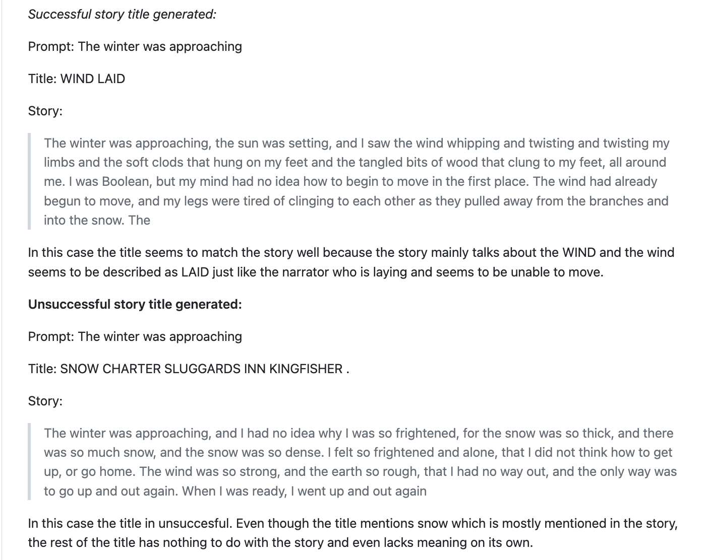

# Machine Learning & Computer Vision
> ## [Indoor Rock Climbing Assistance Tool (IRCAT)](https://github.com/Laura05010/Computer-Science-Expository-Work)
> ### Presenting IRCAT (Indoor Rock Climbing Assistance Tool), an ongoing project stemming from the course "Computer Vision for Assisted Indoor Rock Climbing" (CSC492). IRCAT aims to aid visually impaired individuals in navigating indoor top-rope rock climbs through pose estimation and object detection. The system provides climbing route information via audio feedback, adapting dynamically based on the climber's input. Currently in development, we plan to refine IRCAT continuously with the aim of showcasing our progress and insights at the upcoming Summer Research Fair. Supervised by Professor Lisa Zhang.
> #### **Tools:** Python | Jupyter Notebook

> ## [Brain Tumor Classification](https://github.com/kworathur/CV-Capstone)
> ### As our cumulative project for the Capstone Design course (CSC490), our team addressed the impactful issue of brain tumors. Acknowledging the time-intensive and specialized nature of manual diagnosis, our goal was to develop automatic diagnostic methods for glioma, meningioma, and pituitary tumors using Magnetic Resonance Imaging (MRI) scans. This endeavor involved tackling the challenges of a multi-class classification problem, with a focus on attempting to introduce innovative approaches to enhance the diagnostic process.
> #### **Tools:** Python | Jupyter Notebook

---

# Robotics
> ## [Franka Christmas](https://www.linkedin.com/posts/laurammadrid_frankachristmasmp4-activity-7012888391176380416-j5iv?utm_source=share&utm_medium=member_desktop)
> ### For our final project in the Fundamentals of Robotics course (CSC376), my team and I crafted an environment where the Franka Emika Panda robot could engage in the festive task of decorating a Christmas tree. We successfully programmed the robot to mimic the motions required for this seasonal activity, embracing the spirit of the holiday season.
> #### **Tools:** Franka Emika Panda

---

# Neural Networks and Deep Learning
> ## [Bedtime Story Completion Model](https://github.com/MichaelGitHubHype/413-final-project)
> ### My team and I created two models to assist writers in crafting short bedtime stories, for our Neural Networks & Deep Learning (CSC413) Final Project: a short-story generator that continues story prompts and a title generator using a sequence-to-sequence model. These models, fine-tuned from a pre-trained GPT-2 model and trained from scratch on an RNN for title generation, aim to help writers overcome writer's block and enhance their speed in creating bedtime stories, particularly within the context of children's books.
> #### **Tools:** Python | Jupyter Notebook

---

# Web Development
> ## [Women in Science and Computing (WiSC)  Website](https://utmrobotics.com/)
> ### I designed and developed the WiSC website in collaboration with WiSC executives for user-centric enhancements and future-proofing.
> #### **Tools:** Gatsby | Contentful | HTML | CSS | Javascript

> ## [UTM Robotics Website](https://utmrobotics.com/)
> ### Co-created the second iteration of the UTM Robotics website as a source for the club's social media, events and initiatives. Created the hands design using the Autodesk Sketchbook App which is featured as "Bridge" in the Art section of this site.
> #### **Tools:** Gatsby | Contentful | HTML | CSS | Javascript

> ## [Personal Website V1](https://github.com/Laura05010/my_website_V1)
> ### My first personal website, used as a learning experience to get better at HTML & CSS.
> #### **Tools:** HTML | CSS

---

# WiSC Up a side project
> ## [DIPP: Dog Illness Prevention Project](https://github.com/Laura05010/SideProject2020)
> ### Joined the “Wisc Up a side project” program at the UTM Women In Science & Computing (WISC) club to learn new skills with a partner and a mentor.
> ### Used the Stanford Dogs Dataset to create a website that can help prevent dog illnesses based on the breed. Training a model to detect the dog's breed based on an image and learned to make a web crawler to scrape the illness and prevention data.
> #### **Tools:** Python

---

# Mathematics
> ## [Truth Table Generator](https://github.com/Laura05010/python-truthTables)
> ### Created a program to evaluate logical statements with up to five inputs in the form: P,Q,R,S,T. Learned the concept during my Introduction to Mathematical Proofs Course (MAT102) and decided to automate the tedious process.
> #### **Tools:** Python

